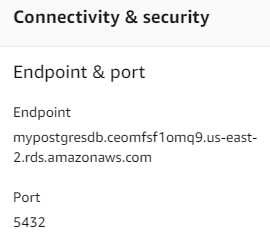
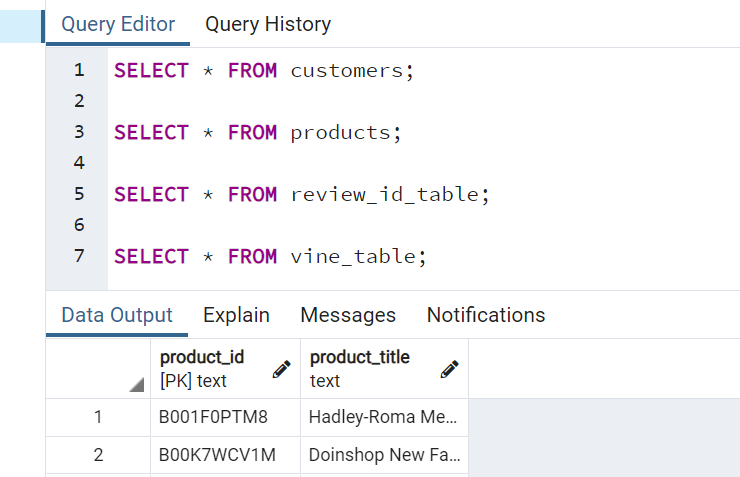
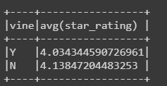
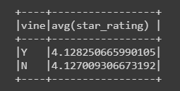
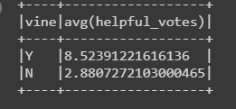
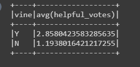

# Big Data Homework - "Alexa, can you handle big data?"

### Homework Due on 10/02/2021

Many of Amazon's shoppers depend on product reviews to make a purchase. Amazon makes these datasets publicly available.  

* The first goal for this homework assignment is to perform an ETL process in the cloud and to upload several dataframes into an RDS instance.
* The second goal is to use PySpark (SQL was not used) to perform statistical analysis regarding Amazons vine review process, to analyze whether the reviews from Amazon's Vine program were trustworthy.  

### Folder Level 1: "level_one_cameras.ipynb" and  "level_one_watches.ipynb"

- Created DataFrames to match the production-ready tables from two of the big Amazon customer review datasets.  The two amazon review files selected are for cameras and watches.   
- Both files have been transformed so the datasets are in alignment with the provided [schema file](../Resources/schema.sql).  To accomplish this, recasting was preformed in PySpark using Google Colab to reformat the data columns into either an integer or date format.  The four dataframe tables were successfully loaded into the RDS instance.  
- A number count for each of the review files are provided in the Google collab files. 
- In both .ipynb files - the schema file for tables customer, products, review_id and vine tables were populated into the PGADMIN (postgres) databases:  "**my_data_class_db**" and "**my_data_class_db_camera**".   
- The Postgress server is titled "**my_aws_postgres_rds_hw**" and the AWS RDS endpoint is "**mypostgresdb.ceomfsf1omq9.us-east-2.rds.amazonaws.com**"

* Query tests were performed in Postgress to ensure connectivity with data tables in RDS cloud.  

  

### Folder Level 2:  "level_two_cameras_and_watches.ipynb"

* Observations while performing statistical analysis on Amazons vine review process.   The analysis did not detect any potential bias or any untrustworthy information pertaining to Vine membership.    
  * The average Star Rating for Vine Members vs Non Members for both cameras and watches is fairly even at ~4 %.   While reviewing the average star rating there does not appear to be any significant bias toward Vine Members. 

  

  

  

  * The average number of "helpful votes" appears to much higher for Vine Members vs Non Members.  This my imply that Vine members are providing a good service for consumers.     

